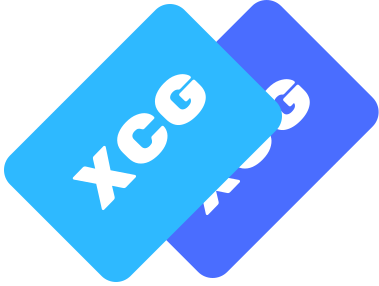

# 

# XCG - XCX Core Gateway

The **XCG - XCX Core Gateway** is a powerful GraphQL API designed to provide a robust and scalable backend service. It enables efficient communication between services, clients, and databases using GraphQL as the primary API interface.

## Features

- GraphQL API for flexible querying
- Built with NestJS and Drizzle ORM
- Fastify-based server for high performance
- Dockerized for easy deployment
